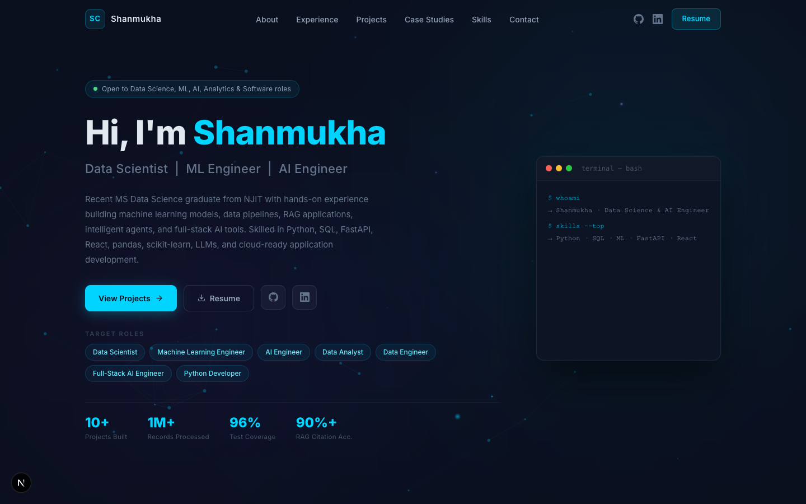

# Shanmukha Srinivas Challa — Portfolio

> AI/ML Engineer · Data Scientist · Full-Stack Developer  
> MS Data Science, NJIT (GPA 3.8) · 4 years of professional experience

**Live:** https://shanmukh1315.github.io/portfolio

---



---

## About

Personal portfolio showcasing AI/ML projects, full-stack engineering experience, and data science work. Features a neural-network canvas hero, globally animated aurora background, terminal typing animation, scroll-reveal cards, and cursor-follow glow effects throughout.

---

## Tech Stack

| | |
|---|---|
| **Framework** | Next.js 16 (App Router, `output: "export"`) |
| **Language** | TypeScript |
| **Styling** | Tailwind CSS + inline styles |
| **Animations** | Framer Motion v11 |
| **Deployment** | GitHub Pages (`gh-pages` branch) |

---

## Features

- **Neural network canvas** — animated nodes, edges, and pulses in the hero; reacts to mouse movement
- **Global aurora background** — soft animated blobs and floating particles visible across all sections (no per-section grid)
- **Cursor spotlight** — radial glow that follows the mouse globally
- **Scroll reveal** — every section animates in on enter and out on exit (`whileInView`, `once: false`)
- **GlowCard hover** — cursor-follow spotlight inside every project, skill, and contact card
- **Terminal typing** — live typewriter animation showing skills and projects
- **Resume download** — latest PDF served directly from `/public`
- **Responsive** — single-column mobile layout via CSS grid overrides

---

## Sections

| # | Section | Description |
|---|---------|-------------|
| 01 | About | Bio, highlight cards, availability status |
| 02 | Experience | Timeline of roles at Virtusa and NJIT |
| 03 | Education | NJIT MS + undergrad |
| 04 | Projects | Filterable project cards with tech tags |
| 05 | Case Studies | In-depth carousel for major projects |
| 06 | Skills | 6 categories matching resume |
| 07 | Contact | Form with GlowCard hover + mailto link |

---

## Local Development

```bash
git clone https://github.com/shanmukh1315/portfolio.git
cd portfolio
npm install
npm run dev
# Open http://localhost:3000/portfolio
```

---

## Deploy to GitHub Pages

```bash
npm run build                        # generates /out

git checkout gh-pages
git checkout main -- out/
cp -r out/* .
rm -rf out
touch .nojekyll
git add -A
git commit -m "Deploy"
git push origin gh-pages
git checkout main
```

---

## Project Structure

```
portfolio-site/
├── app/
│   ├── layout.tsx              # Root layout — mounts ClientWrapper
│   ├── page.tsx                # All sections composed here
│   └── globals.css
├── components/
│   ├── GlobalBackground.tsx    # Fixed aurora blobs + particles (z-0)
│   ├── ClientWrapper.tsx       # Renders GlobalBackground + CursorSpotlight
│   ├── CursorSpotlight.tsx     # Global cursor radial glow
│   ├── GlowCard.tsx            # Mouse-follow spotlight wrapper
│   ├── Hero.tsx                # Canvas + terminal + entry animations
│   ├── Navbar.tsx
│   ├── About.tsx
│   ├── Experience.tsx
│   ├── Education.tsx
│   ├── Projects.tsx
│   ├── CaseStudies.tsx
│   ├── Skills.tsx
│   ├── Contact.tsx
│   └── Footer.tsx
├── lib/
│   └── data.ts                 # Personal info, resume URL, project data
└── public/
    └── Shanmukha_Challa_Resume.pdf
```

---

## Contact

| | |
|---|---|
| Email | shanmukhasrinivaschalla@gmail.com |
| LinkedIn | https://linkedin.com/in/shanmukh1315 |
| GitHub | https://github.com/shanmukh1315 |
| Location | Newark, NJ |
